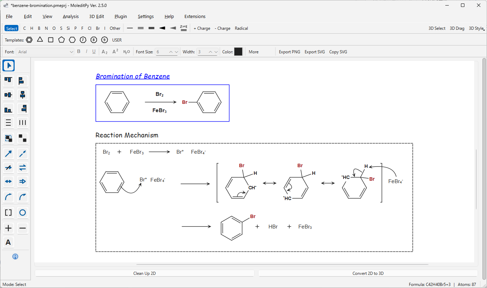

# Reaction Sketcher Plugin for MoleditPy

A comprehensive chemical reaction sketching tool for MoleditPy, allowing users to draw reaction text, arrows, brackets, and annotations directly in the 2D workspace.

## Features

- **Reaction Arrows**: Standard (Forward), Equilibrium, Resonance, Retrosynthetic, Dashed, and "No Reaction" arrows.
- **Curved Arrows**: Electron pushing arrows (Double headed and Fish-hook/Single electron).
- **Annotations**: Text boxes, Plus (+), and Minus (-) signs.
- **Shapes & Grouping**: 
  - **Brackets**: Square, Round, Curly.
  - **Shapes**: Circles and Ellipses.
  - **Grouping**: Select multiple items and press `Ctrl+G` to group them for easy movement and selection. Use `Ctrl+U` to ungroup.
- **Alignment & Distribution**: 
  - Align selected items: Top, Bottom, Left, Right, Center (Horizontal/Vertical).
  - Distribute items evenly: Horizontally or Vertically.
- **Enhanced Properties Toolbar**:
  - **Typography**: Change Font family, Size, and Style (Bold, Italic, Underline).
  - **Chemistry Mode**: Automatic subscripting for chemical formulas (e.g., `H2O` -> `H₂O`).
  - **Styling**: Quick access to Line Width and Color for all reaction items.
- **Enhanced Clipboard**: Copy and paste molecules alongside reaction items seamlessly.
- **Undo/Redo Support**: Fully integrated with the main application's undo stack.
- **Smart Interaction**:
  - **Consistent Selection**: Atoms show a clear blue rectangle highlight when selected, including skeletal carbons.
  - **Angle snapping**: 15-degree increments for straight arrows (hold **Alt** to bypass).
  - **Context Menu**: **Shift+Right-Click** on any item to access specific styles or open Advanced Properties.
  - **Double-click**: Instantly edit Text items.
  - **Right-Click**: Quick delete of items.

## Installation

1. Download the zip file from [Plugin Explorer](https://hiroyokoyama.github.io/moleditpy-plugins/explorer/?q=Reaction+Sketcher).
2. Copy the `reaction_sketcher` folder into the `plugins` directory of your MoleditPy installation.
3. Restart MoleditPy.

## Usage

### Activation
- Activate from the menu: `Extensions -> Reaction Sketcher...`.

### Tools Overview
The side toolbar provides categorized tools:
- **Selection**: 
  - **Select**: Move objects.
  - **Alignment Icons**: Top, Left, Center V, Center H, Bottom, Right.
  - **Distribution Icons**: Distribute V, Distribute H.
- **Grouping**: **Group** and **Ungroup** buttons.
- **Arrows**: Standard, Dashed, No Rxn, Equilibrium, Resonance, Retro.
- **Curved Arrows**: Double headed (2e-) and Fish-hook (1e-).
- **Shapes**: Bracket (Right-click for Square/Round/Curly) and Circle/Rectangle.
- **Text & Signs**: Plus/Minus signs and Text boxes.

### Customization
**Basic Actions:**
- **Right-Click**: Delete the item under cursor.
- **Shift + Right-Click**: Open **Context Menu** for quick style changes.
- **Advanced Settings**: Accessible via Context Menu -> Advanced Settings. Save templates as "Default" to apply them automatically to new items.

### Tips
- **Mode Isolation**: Reaction drawing tools are strictly active only in Reaction Mode. Standard molecular editing is unaffected.
- **3D Conversion**: The "Convert to 3D" button is disabled while in Reaction Mode to preserve annotations.
- **Curve Control**: Use the orange control points to adjust the arc of curved arrows.
- **Angle Snap**: Hold **Alt** to draw arrows at free angles.

## License & Disclaimer
This project is licensed under the GNU General Public License v3.0 (GPLv3) - see the [LICENSE](LICENSE) file for details. As open-source software, it is provided 'as is' without warranty of any kind, and the author assumes no responsibility or liability for the results. Although outputs have been carefully verified, users are strongly encouraged to independently check and validate them for critical applications (such as publications). If you encounter any bugs, please open an issue.
